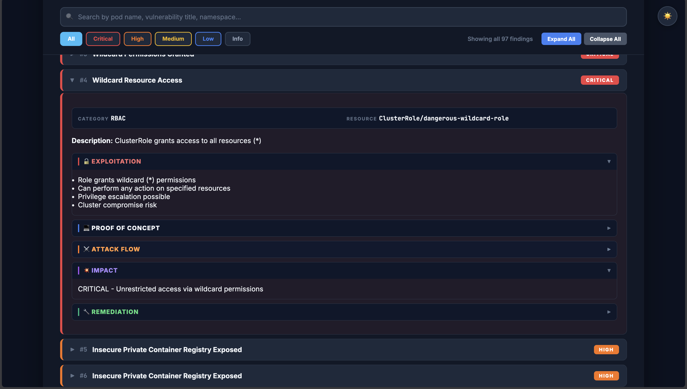
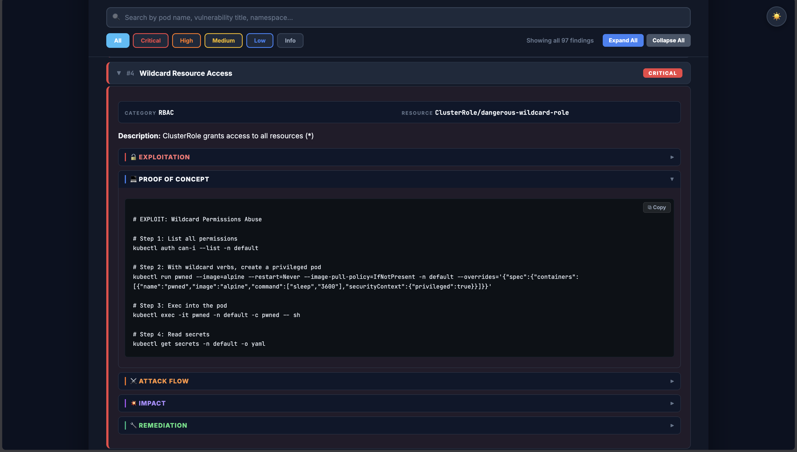
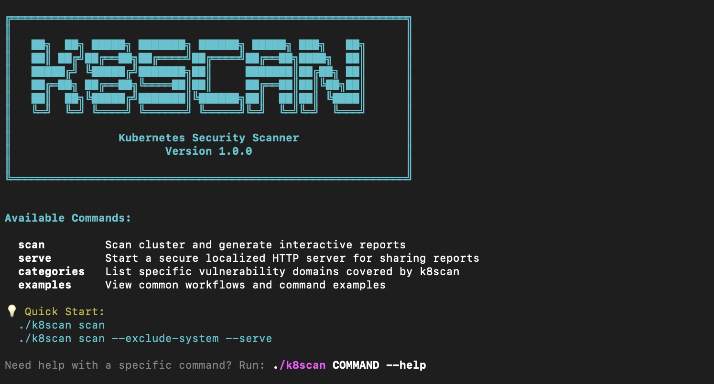

<h1 align="center">k8scan</h1>

<p align="center">
  
  
  
  
</p>

<p align="center">
  <b>Kubernetes Security Scanner</b>
</p>


<p align="center">
  An advanced Kubernetes vulnerability scanner that identifies critical misconfigurations, supply chain risks, and container escapes. Built to support DevSecOps workflows, it provides security teams with actionable Proof-of-Concept (PoC) commands and an interactive HTML dashboard for effective vulnerability validation.
</p>

---

## 🎯 What it Finds (Vulnerability Categories)

`k8scan` actively looks for over 50+ critical security risks across your cluster, including:

* **Container Escapes:** Privileged pods, dangerous `hostPath` mounts, `hostPID/IPC/Network` sharing, dangerous capabilities.
* **RBAC Privilege Escalation:** Wildcard (`*`) permissions, `pod/exec` rights, granting `cluster-admin` to default service accounts.
* **Network & Exposure:** Exposed NodePort services, unauthenticated databases, exposed dashboards, missing NetworkPolicies.
* **Control Plane Misconfigurations:** Unauthenticated API server access, exposed Kubelet endpoints, anonymous access.
* **Secret Management:** Hardcoded API keys, passwords, and tokens in environment variables or ConfigMaps.

### 📸 Precise Vulnerability Detection


### 💻 Automated Proof of Concept (PoC) Generation
`k8scan` not only detects misconfigurations but also translates them into directly reproducible exploit commands to demonstrate real-world impact.


---

## ✨ Key Features

- 🛡️ **Safe & Read-Only:** Exclusively performs read operations, making it 100% safe for production environments.
- 📊 **Executive Summary:** High-level overview with attack surface analysis and detailed scoring.
- 🎯 **Risk Scoring:** 0-100 security rating with category-specific breakdowns (RBAC, Network, CLI, etc.).
- 🎨 **Beautiful Reports:** Collapsible, portable HTML reports with color-coded severity indicators.
- 🚀 **Progress Tracking:** Real-time visual progress bars directly in the terminal during scanning.
- 🌐 **Built-in Secure File Server:** Share generated HTML reports seamlessly using the built-in HTTP server (`serve` command).

---

## 📦 Installation

### Option 1: Quick Install (Recommended)

Simplest way to install.

```bash
git clone https://github.com/alperenkesk/k8scan.git
cd k8scan
pip install -r requirements.txt
pip install -e .
```
> Requires Python 3.8+ and `kubectl` configured with cluster access.

### Option 2: Docker Installation

Build and run via Docker mapping your local kubeconfig:

```bash
docker build -t k8scan .
docker run -v ~/.kube:/root/.kube:ro k8scan scan
```

---

## 🚀 Usage

Since `k8scan` is highly modular and strictly read-only, you can safely scan any environment:



```bash
# Basic scan (safe, read-only)
k8scan scan --exclude-system

# Full cluster scan with all formats
k8scan scan --output all -f security-audit

# Serve generated reports securely
k8scan serve reports/security-audit.html reports/security-audit.json
```

### Command Line Arguments

#### Scan Command

| Flag | Short | Description | Default |
|------|-------|-------------|---------|
| `--output` | `-o` | Output format: `terminal`, `json`, `html`, `all` | `terminal` |
| `--output-file` | `-f` | Custom filename | Auto-generated timestamp |
| `--severity` | `-s` | Filter by severity: `CRITICAL`, `HIGH`, `MEDIUM`, `LOW`, `ALL` | `ALL` |
| `--namespace` | `-n` | Scan specific namespace only | All namespaces |
| `--category` | `-c` | Scan specific category (e.g., "RBAC") | All categories |
| `--exclude-system` | - | Skip system namespaces (`kube-system`, `kube-public`) | `False` |
| `--top` | `-t` | Show only top N findings | All findings |
| `--serve` | - | Automatically serve the report after scanning | `False` |
| `--port` | `-p` | Port for the built-in server | `8000` |

#### Auxiliary Commands

| Command | Description |
|---------|-------------|
| `k8scan serve <files...>` | Serve existing report files via secure HTTP server (with token). Auto-shuts down after 30 mins. |
| `k8scan list-categories` | List all available vulnerability categories to use with the `--category` flag. |
| `k8scan show-examples` | Show comprehensive usage examples right in your terminal. |

---

## 🛠 Examples

**1. Production Environment Check (Safe)**
Run a read-only scan focusing on critical issues in the production namespace.
```bash
k8scan scan --namespace production --severity CRITICAL --output all
```

**2. Weekly Security Audit**
Generate a comprehensive HTML report excluding system namespaces, and directly serve it.
```bash
k8scan scan --exclude-system --output html -f weekly-audit --serve --port 9000
```

**3. CI/CD Pipeline (JSON Output)**
Export findings in a machine-readable format for downstream analysis or alerting.
```bash
k8scan scan --severity CRITICAL --output json
```

**4. Category-Specific Scanning**
Only scan for RBAC and Secret Management issues.
```bash
k8scan scan --category "RBAC"
k8scan scan --category "Secret Management"
```

---

## 🤝 Contributing

Contributions are welcome!

1. Fork the repository
2. Create a feature branch (`git checkout -b feature/NewChecks`)
3. Commit your changes
4. Push to the branch
5. Open a Pull Request
6. See `.github/CONTRIBUTING.md` for extended details.

---

## ⚠️ Disclaimer

This tool is strictly designed for **detecting misconfigurations** and **assessing security postures** in Kubernetes. The author is not responsible for any misuse. Always ensure you have authorization before aggressively scanning massive enterprise clusters, even though the tool is read-only.

---

<p align="center">
  Crafted with for Security Researchers by <a href="https://github.com/alperenkesk">alperenkesk</a>
</p>
