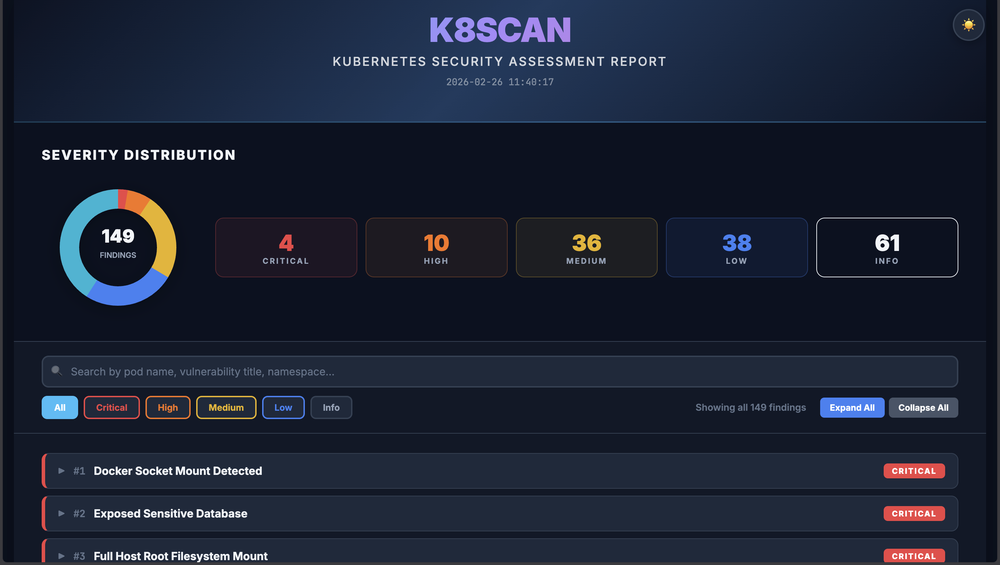
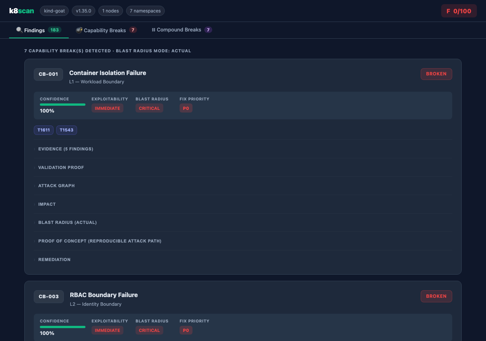
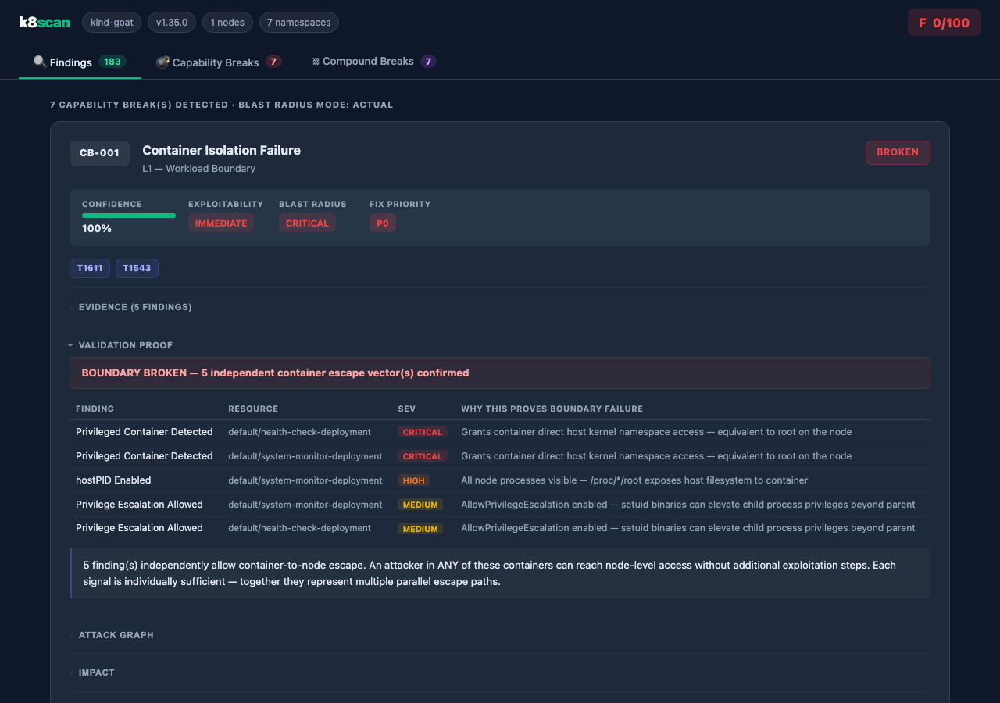
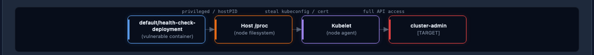
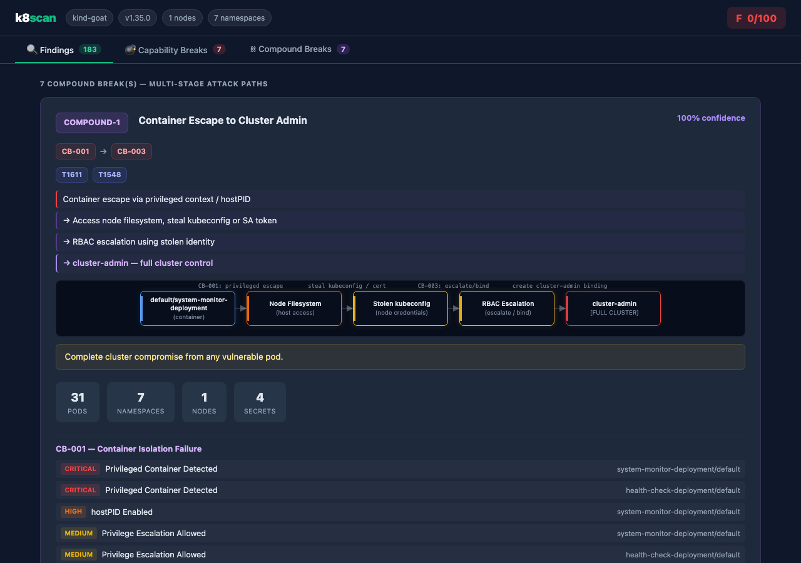
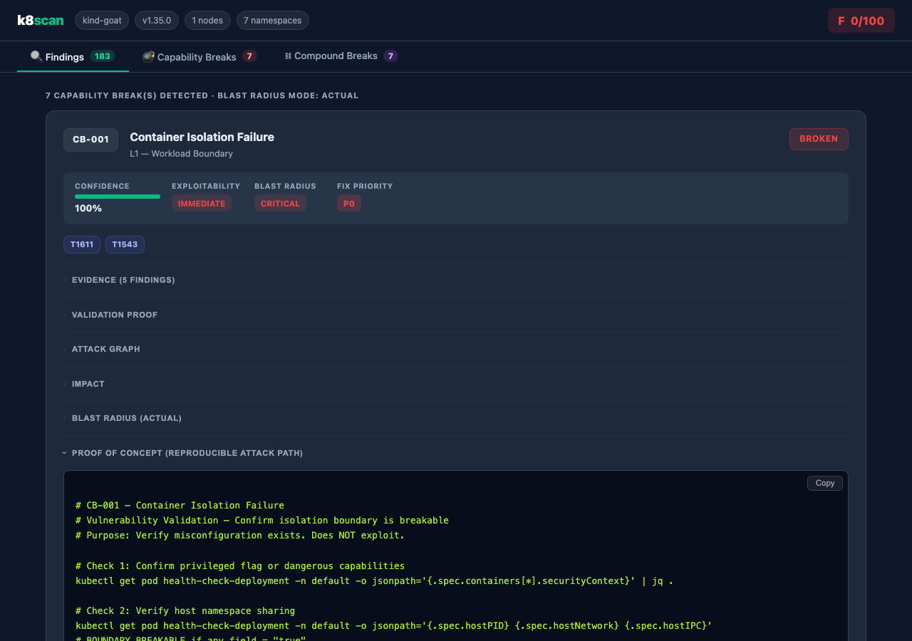

<h1 align="center">k8scan</h1>

<p align="center">
  
  
  
  
</p>

<p align="center">
  <b>Kubernetes Security Scanner</b>
</p>



<p align="center">
  A fast, read-only Kubernetes security scanner written in Go. Detects misconfigurations, privilege escalation paths, exposed secrets, and container escape vectors — then correlates findings into <b>Capability Breaks</b> and <b>Compound Attack Paths</b> with validation-grade Proof-of-Concept commands.
</p>

---

## What it Finds

123+ checks across 8 categories:

| Category | Examples |
|---|---|
| **Container Security** | Privileged pods, dangerous capabilities (SYS_ADMIN, BPF), hostPID/IPC/Network, sensitive hostPath mounts, writable root filesystem |
| **RBAC** | Wildcard permissions, `pod/exec` access, `system:masters` binding, cross-namespace SA grants, cluster-admin to non-system subjects |
| **Secrets** | Hardcoded AWS keys, GitHub tokens, private keys in env vars or ConfigMaps, empty passwords, expired TLS certificates |
| **Network** | Exposed NodePorts, missing NetworkPolicies, permissive ingress/egress, cloud metadata API exposure, LoadBalancer without source ranges |
| **Control Plane** | Anonymous API server access, kubelet read-only port, etcd without auth/TLS, admission webhook `failurePolicy: Ignore`, audit logging disabled |
| **Workload** | Missing PodDisruptionBudget, no resource limits, Recreate update strategy, single replica, missing HPA |
| **Image** | Images not pinned to digest, potentially untrusted registries |
| **Runtime Threats** | Crypto miner detection, Docker-in-Docker, no runtime security monitoring |

---

## Capability Break Analysis

k8scan goes beyond individual findings. It correlates misconfigurations into **Capability Breaks** — structured proof that a named security boundary (container isolation, namespace isolation, RBAC boundary, etc.) is broken by the current cluster state.



Each Capability Break includes a **Validation Proof** — a deterministic table of signals showing exactly which findings prove the boundary is broken, their individual significance, and a combined verdict explaining the full impact.



### Attack Graph

Each Capability Break and Compound Break renders an interactive attack graph showing the lateral movement path from initial access to the final target.



---

## Compound Break Analysis

When two or more Capability Breaks chain together, k8scan surfaces a **Compound Break** — a complete multi-stage attack path with weighted confidence, blast radius, and MITRE ATT&CK mapping.



---

## Proof-of-Concept Commands

Every Capability Break ships a validation-focused PoC — read-only `kubectl` commands that confirm the misconfiguration exists without modifying cluster state.



---

## Key Features

- **Single Static Binary** — no runtime dependencies, no Python, no plugins
- **Read-Only** — uses only `get`, `list`, `watch` API calls; safe for production
- **Five Output Formats** — terminal, JSON, HTML (dark theme), SARIF 2.1.0, Markdown
- **Capability Break Engine** — 10 security boundary checks (CB-001..CB-010) with signal matching, weighted confidence, and blast radius (INFER / PROJECTED / ACTUAL modes)
- **Compound Break Detection** — 10 multi-stage attack path rules correlating active Capability Breaks
- **Static Analysis** — `k8scan lint` scans YAML, Helm charts, and Kustomize overlays without a live cluster
- **CI/CD Native** — `--fail-on CRITICAL` exits with code 2 when findings meet threshold; SARIF output integrates with GitHub Advanced Security
- **CIS Benchmark Mapping** — findings are tagged with CIS Kubernetes Benchmark controls
- **Suppression Rules** — `.k8scan-ignore.yaml` to silence known-accepted findings
- **In-Cluster Scanning** — run as a Kubernetes Job or CronJob using the provided manifests in `deploy/`

---

## Installation

### Binary (Recommended)

```bash
git clone https://github.com/alperenkesk/k8scan.git
cd k8scan
make build
# Binary is at ./bin/k8scan
```

> Requires Go 1.24+ and `kubectl` configured with cluster access.

### Cross-Platform Release Builds

```bash
make release
# Produces binaries for Linux/macOS (amd64 + arm64) and Windows (amd64) under ./bin/
```

### Docker

```bash
# Pull from GitHub Container Registry (recommended)
docker pull ghcr.io/alperenkesk/k8scan:latest
docker run -v ~/.kube:/root/.kube:ro ghcr.io/alperenkesk/k8scan:latest scan

# Pin to a specific version
docker pull ghcr.io/alperenkesk/k8scan:v2.0
```

Or build locally:

```bash
docker build -t k8scan .
docker run -v ~/.kube:/root/.kube:ro k8scan scan
```

The image is built on `distroless/static-debian12:nonroot` — no shell, no package manager.

### In-Cluster (Job / CronJob)

```bash
kubectl apply -k deploy/
```

This applies the provided Namespace, RBAC, one-off Job, and scheduled CronJob manifests. For GitOps workflows, create a Kustomize overlay that uses `deploy/` as a base and patches the schedule, image, or RBAC resources without editing these tracked manifests.

You can also apply the raw YAML files individually:

```bash
kubectl apply -f deploy/k8scan-namespace.yaml
kubectl apply -f deploy/k8scan-rbac.yaml
kubectl apply -f deploy/k8scan-job.yaml      # one-off scan
kubectl apply -f deploy/k8scan-cronjob.yaml  # scheduled scan
```

---

## Usage

```bash
# Full cluster scan — print to terminal
k8scan scan

# Scan specific namespace, filter severity
k8scan scan --namespace production --min-severity HIGH

# Generate all report formats
k8scan scan --output-html report.html --output-json report.json --output-sarif report.sarif

# CI/CD pipeline — exit code 2 if any CRITICAL finding
k8scan scan --output-sarif results.sarif --fail-on CRITICAL

# Group identical findings (count instead of per-resource lines)
k8scan scan --group

# CIS Benchmark compliance summary
k8scan scan --cis-report

# Static analysis — no cluster required
k8scan lint ./manifests/
k8scan lint ./charts/myapp/ --helm ./charts/myapp/ -f values-prod.yaml
cat deploy.yaml | k8scan lint -
```

---

## Commands

### `k8scan scan`

Scan a live Kubernetes cluster.

| Flag | Description | Default |
|---|---|---|
| `--namespace`, `-n` | Namespaces to scan (repeatable) | all |
| `--category` | Filter by category: `container`, `rbac`, `secrets`, `network`, `control-plane`, `workload` | all |
| `--min-severity` | Minimum severity: `CRITICAL`, `HIGH`, `MEDIUM`, `LOW`, `INFO` | `INFO` |
| `--output-html` | Write HTML report to file | — |
| `--output-json` | Write JSON report to file | — |
| `--output-sarif` | Write SARIF 2.1.0 report (GitHub Advanced Security) | — |
| `--output-md` | Write Markdown report to file | — |
| `--fail-on` | Exit code 2 if findings at or above severity exist | — |
| `--group` | Collapse identical findings — show count per title | `false` |
| `--cis-report` | Print CIS Benchmark compliance summary | `false` |
| `--no-exploits` | Skip PoC enrichment | `false` |
| `--ignore-file` | Suppression rules file | `.k8scan-ignore.yaml` |
| `--parallel` | Run scanners concurrently | `true` |
| `--timeout` | Scan timeout in seconds | `120` |

### `k8scan lint [paths...]`

Statically analyse manifests without a live cluster.

| Flag | Description |
|---|---|
| `--helm <path>` | Render a Helm chart with `helm template` before scanning |
| `--helm-values`, `-f` | Additional Helm values files (repeatable) |
| `--kustomize <path>` | Render with `kubectl kustomize` before scanning |
| `--output-html/json/sarif/md` | Same as `scan` |
| `--fail-on` | Same as `scan` |

### `k8scan categories`

List all available scan categories with supported output formats.

### `k8scan version`

Print version and build information.

---

## Suppression Rules

Create `.k8scan-ignore.yaml` to silence accepted risks:

```yaml
rules:
  - title: "Missing Network Policy"
    namespace: staging
    reason: "Isolated VPC, network policy not required"

  - title: "Single Replica Deployment"
    resource: "batch-worker"
    reason: "Stateless batch job, HA not required"
```

---

## CI/CD Integration

### GitHub Actions

```yaml
- name: k8scan security audit
  run: |
    ./bin/k8scan scan \
      --output-sarif k8scan.sarif \
      --fail-on HIGH

- name: Upload SARIF to GitHub Security
  uses: github/codeql-action/upload-sarif@v3
  with:
    sarif_file: k8scan.sarif
```

SARIF output is compatible with GitHub Advanced Security, GitLab Security Dashboard, and any SARIF 2.1.0 consumer.

---

## Contributing

1. Fork the repository
2. Create a feature branch (`git checkout -b feature/new-check`)
3. Add your check in `internal/scanners/` and a corresponding PoC in `internal/exploits/`
4. Run `go test ./... -race` and `go build ./...`
5. Open a Pull Request

---

## Disclaimer

This tool is designed for **detecting misconfigurations** in Kubernetes environments. The author is not responsible for any misuse. Always obtain proper authorization before scanning environments you do not own or manage. The tool performs read-only API calls and does not modify cluster state.

---

<p align="center">
  Built for security engineers by <a href="https://github.com/alperenkesk">alperenkesk</a>
</p>
